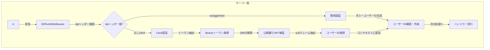

# Clerk

Clerk は、このアプリケーションで使用されている認証プロバイダーです。JWT トークンベースの認証を提供し、セキュアなユーザー認証を実現します。

## 設定

Clerk を使用するには、環境変数に以下の設定が必要です：

```bash
CLERK_JWKS_URL=https://api.clerk.dev/v1/jwks/YOUR_CLERK_INSTANCE
```

この設定は JWT 検証に使用される JWKS エンドポイントを指定します。

## IDP（Identity Provider）の設定

このアプリケーションでは、複数の認証プロバイダー（IDP）をサポートする設計となっています。現在は以下の IDP が実装されています：

1. **Clerk**: メインの認証プロバイダーとして使用
    - JWT 検証とユーザー管理を提供
    - 本番環境で使用される標準的な認証方式
2. **開発・テスト用 IDP**:
    - **Swagger**: API ドキュメント用の簡易認証（`idp: swagger`ヘッダーを使用）
    - **Test**: 自動テスト用の簡易認証（`idp: test`ヘッダーを使用）

IDP の切り替えは、リクエストヘッダーの `idp` フィールドで制御されます。ヘッダーが指定されていない場合は、デフォルトで Clerk が使用されます。

開発環境やテスト環境では、DB コネクションも IDP に応じて切り替わります：

```go
dbConn := dbConnManager.GetConnection(idp) // idpに基づいて適切なDBコネクションを取得
```

新しい IDP を追加する場合は、以下の手順が必要です：

1. 新しい IDP に対応するリポジトリの実装
2. IDPAuthMiddleware への新しい IDP の追加
3. 必要に応じた DB コネクション設定の追加

## 認証フロー

このアプリケーションでは、以下の認証フローが実装されています：

### 1. クライアント側での認証

1. ユーザーが Clerk の UI でログイン
2. Clerk がセッショントークン（JWT）を発行
3. クライアントアプリケーションがそのトークンを保存
4. API 呼び出し時に`Authorization: Bearer <token>`ヘッダーとしてトークンを送信

### 2. サーバー側での認証（Middleware での処理）

1. `IDPAuthMiddleware`がリクエストを受け取る
2. `Authorization`ヘッダーから Bearer トークンを抽出
3. Clerk JWKS エンドポイントから公開鍵を取得（`ClerkAuthRepository.FetchJWKS()`）
4. JWT の検証（署名確認、有効期限チェックなど）
5. トークンから`sub`クレーム（ユーザー ID）を抽出
6. ユーザー ID をコンテキストに設定し、後続の処理で利用可能に
7. ユーザーがデータベースに存在しない場合は自動的に作成

### 特別なケース

開発やテスト環境では、以下の簡易認証も利用可能です：

- **Swagger 用**: `idp: swagger`ヘッダーを使用
- **テスト用**: `idp: test`ヘッダーを使用

これらのケースでは、ダミーユーザー ID が自動的に割り当てられ、JWT の検証はスキップされます。

### 認証フローの図解
