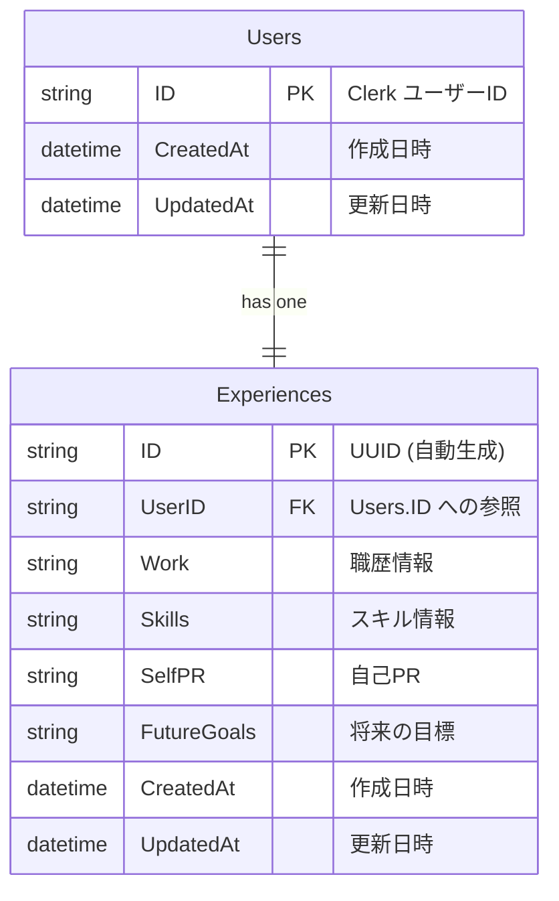

## データベース設計

このアプリケーションでは、ユーザー情報と経験（エクスペリエンス）情報を管理するためのデータベース設計が実装されています。

### ER 図

以下の ER 図は、アプリケーションで使用されているテーブル間の関係を示しています：

### テーブル構造

### Users テーブル

ユーザー情報を格納するテーブルです。Clerk 認証システムから取得したユーザー ID を主キーとして使用します。

| フィールド名 | 型 | 説明 |
| --- | --- | --- |
| ID | string | 主キー。Clerk から提供されるユーザー ID |
| CreatedAt | datetime | レコード作成日時 |
| UpdatedAt | datetime | レコード更新日時 |

### Experiences テーブル

ユーザーの経験情報を格納するテーブルです。一人のユーザーに対して一つのエクスペリエンスレコードが関連付けられます。

| フィールド名 | 型 | 説明 |
| --- | --- | --- |
| ID | string | 主キー（UUID、自動生成） |
| UserID | string | 外部キー（Users.ID を参照） |
| Work | string | 職歴情報 |
| Skills | string | スキル情報 |
| SelfPR | string | 自己 PR 文 |
| FutureGoals | string | 将来の目標 |
| CreatedAt | datetime | レコード作成日時 |
| UpdatedAt | datetime | レコード更新日時 |

### リレーションシップ

- **Users ⟷ Experiences**: 1 対１のリレーションシップ

### データアクセスパターン

アプリケーションでは、以下のようなデータアクセスパターンが使用されています：

1. **ユーザー認証時**:
    - ユーザー ID を使用して Users テーブルにレコードが存在するか確認
    - 存在しない場合は、新しいユーザーレコードを自動的に作成
2. **エクスペリエンス情報の管理**:
    - エクスペリエンス情報の作成・更新・取得操作はすべてユーザー ID に紐づいて行われます
    - InputExperience 構造体を使用して、クライアントからのデータ入力を受け付けます

### データベースマイグレーション

テーブルスキーマの変更が必要な場合は、適切なマイグレーション処理を実行する必要があります。このアプリケーションでは、GORM を使用して ORM（オブジェクト・リレーショナル・マッピング）を実装しています。